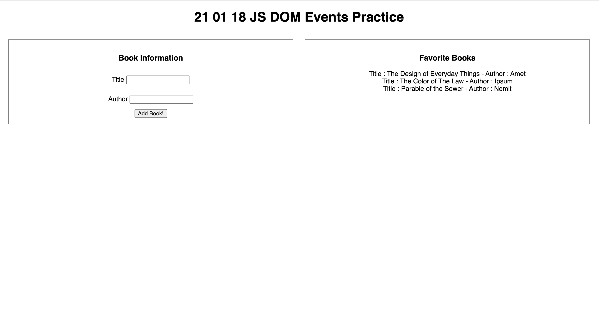

# 21 01 18 JS DOM Events Practice

## Practice
Add comments throughout the JavaScript file. HTML, CSS, and JS files have already been included in the assignment with some starter code. Comment out any broken code before 9PM submission and provide context on what's not working.

## Requirements
Use the starter code that is already present in the HTML and CSS files to recreate the wireframe image provided. Display a form to add a book to your list of favorite books to the left in the `bookForm` div. Display the list of books from form submission to the right in the `bookList` div.

You will need to select both form input fields, the form submit button, and the `bookList` div in your JavaScript file. When the form submit button is clicked a function to handle the submission should be called. 

The function to handel form submission should preform the following actions :
- Stop the page from reloading
- Append the values from both form fields in the `bookList` div mimicking the wireframe
- Clear the values from both form fields
